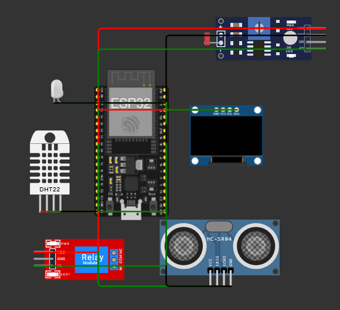
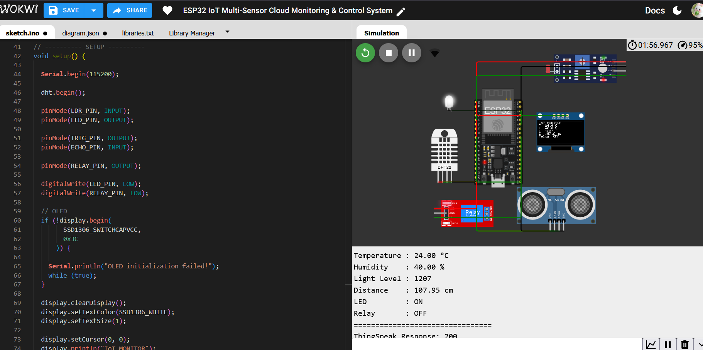
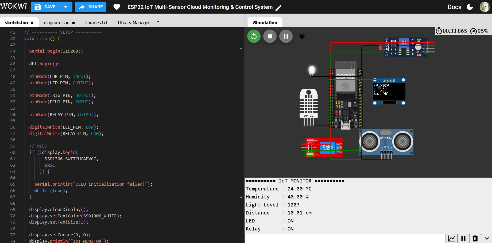
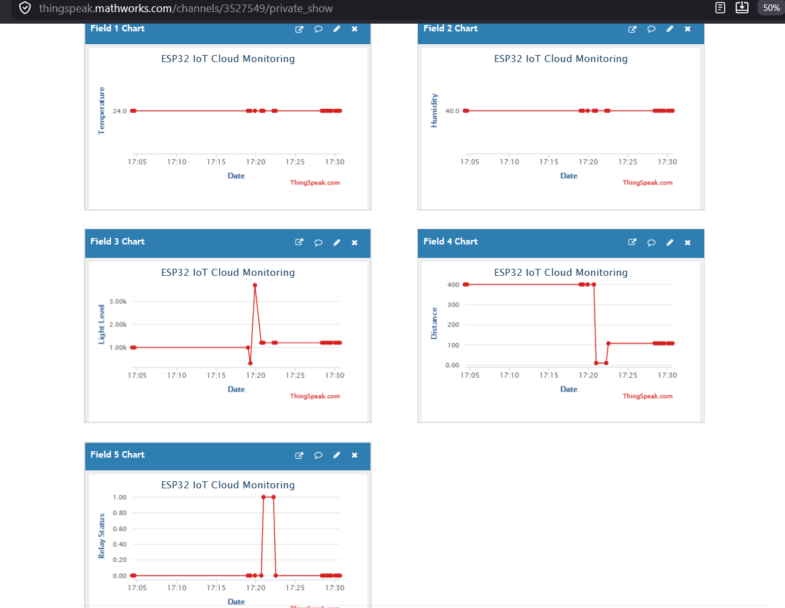

# ESP32 IoT Multi-Sensor Cloud Monitoring & Control System

An ESP32-based IoT system that integrates multiple sensors, local automation, OLED monitoring, Wi-Fi connectivity, and ThingSpeak cloud monitoring into a single system.

The project demonstrates how sensor data can be collected by an ESP32, processed locally for automation, displayed on an OLED, and uploaded to the cloud for remote monitoring.

---

## 🚀 Features

* 🌡️ Temperature and humidity monitoring using DHT22
* 💡 Light-level monitoring using LDR
* 📏 Distance measurement using HC-SR04 ultrasonic sensor
* 💡 Automatic LED control based on light level
* ⚡ Automatic relay control based on distance
* 🖥️ Real-time OLED display
* 📡 ESP32 Wi-Fi connectivity
* ☁️ ThingSpeak cloud integration
* 📊 Multi-field cloud data monitoring
* 🔄 Sensor-based automatic decision making

---

## 🧰 Components Used

* ESP32 DevKit C V4
* DHT22 Temperature & Humidity Sensor
* LDR / Photoresistor
* HC-SR04 Ultrasonic Sensor
* SSD1306 OLED Display
* Relay Module
* LED
* Wokwi ESP32 Simulator
* ThingSpeak Cloud Platform

---

## 🔌 Pin Configuration

| Component         | ESP32 Pin |
| ----------------- | --------- |
| DHT22 Data        | GPIO 4    |
| LDR Analog Output | GPIO 34   |
| LED               | GPIO 5    |
| HC-SR04 TRIG      | GPIO 25   |
| HC-SR04 ECHO      | GPIO 26   |
| Relay IN          | GPIO 18   |
| OLED SDA          | GPIO 21   |
| OLED SCL          | GPIO 22   |

---

## ⚙️ System Working

The system continuously reads data from the connected sensors and processes the readings using the ESP32.

### 1. Temperature & Humidity Monitoring

The DHT22 measures:

* Temperature
* Humidity

The readings are displayed on the Serial Monitor and OLED display.

### 2. Light-Based Automation

The LDR measures the surrounding light level.

Based on the programmed threshold:

* Low light → LED ON
* Higher light level → LED OFF

### 3. Distance-Based Automation

The HC-SR04 measures the distance of a nearby object.

The relay is automatically controlled using the measured distance:

* Distance < 20 cm → Relay ON
* Distance ≥ 20 cm → Relay OFF

### 4. OLED Monitoring

The SSD1306 OLED displays important real-time information:

* Temperature
* Humidity
* Light level
* Distance
* Relay status

### 5. Cloud Monitoring

The ESP32 connects to Wi-Fi and sends sensor data to ThingSpeak using HTTP requests.

A successful cloud update returns:

```text
ThingSpeak Response: 200
```

---

## ☁️ ThingSpeak Cloud Fields

| Field   | Parameter    |
| ------- | ------------ |
| Field 1 | Temperature  |
| Field 2 | Humidity     |
| Field 3 | Light Level  |
| Field 4 | Distance     |
| Field 5 | Relay Status |

This allows the collected data to be monitored through cloud-based graphs.

---

## 🧪 Testing Results

### Normal Condition

```text
Temperature : 24.00 °C
Humidity    : 40.00 %
Light Level : 1207
Distance    : 107.95 cm
LED         : ON
Relay       : OFF
ThingSpeak Response: 200
```

Since the measured distance is greater than 20 cm, the relay remains OFF.

### Automation Condition

When an object is brought closer to the ultrasonic sensor:

```text
Temperature : 24.00 °C
Humidity    : 40.00 %
Light Level : 1207
Distance    : 10.01 cm
LED         : ON
Relay       : ON
```

Since the distance is below 20 cm, the relay automatically turns ON.

---

## 📸 Project Screenshots

### Wokwi Circuit



### Normal Output



### Automation Output



### ThingSpeak Dashboard



---

## 📁 Project Structure

```text
ESP32-IoT-Multi-Sensor-Cloud-Monitoring/
│
├── sketch.ino
├── diagram.json
├── libraries.txt
├── README.md
│
└── images/
    ├── wokwi_circuit.png
    ├── normal_output.png
    ├── automation_output.png
    └── thingspeak_dashboard.png
```

---

## 🧪 Simulation & Development

The project was developed and tested using the **Wokwi ESP32 simulator**.

The complete system demonstrates the following IoT workflow:

```text
Sensors
   ↓
ESP32
   ↓
Data Processing
   ↓
Local Automation
   ↓
OLED Display
   ↓
Wi-Fi
   ↓
ThingSpeak Cloud
```

---

## 🎯 Learning Outcomes

This project helped develop practical understanding of:

* ESP32 programming
* Multiple sensor integration
* Analog and digital GPIO handling
* I2C communication
* OLED interfacing
* Relay control
* Sensor-based automation
* Wi-Fi connectivity
* HTTP communication
* Cloud data transmission
* ThingSpeak integration
* Real-time IoT monitoring

---

## 🔮 Future Improvements

Possible future upgrades include:

* MQTT-based real-time communication
* Web-based IoT dashboard
* Mobile monitoring and control
* Remote actuator control
* Additional sensors
* Event-based notifications
* Advanced IoT data analytics
* Integration with a dedicated IoT backend

---

## 👩‍💻 Author

**Tanisha Karan**

B.Tech — Internet of Things / Computer Science

This project is part of my journey toward becoming an **IoT Engineer**.

---

⭐ If you find this project interesting, feel free to explore the repository and its implementation.
